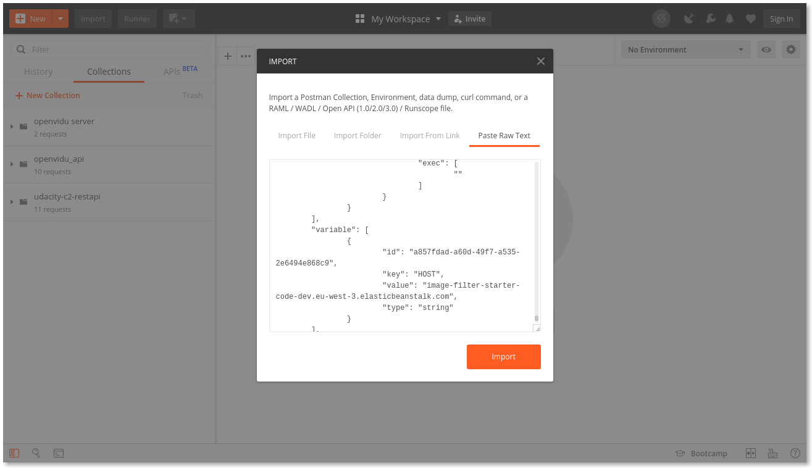
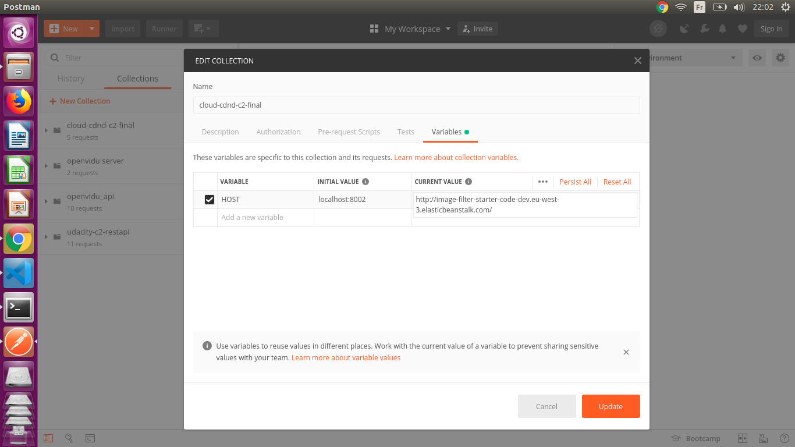
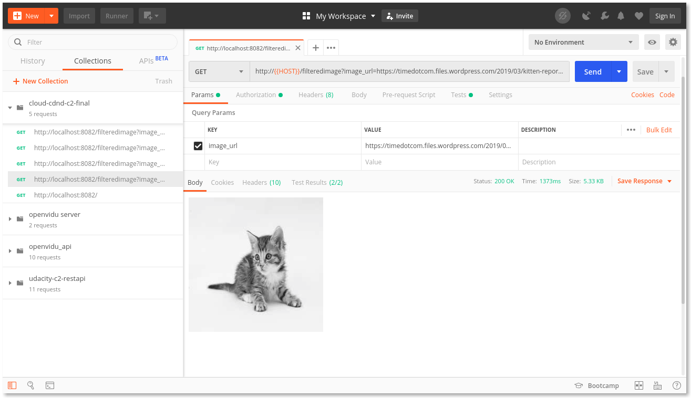

# Udagram Image Filtering Microservice

Udagram is a simple cloud application developed alongside the Udacity Cloud Engineering Nanodegree. It allows users to register and log into a web client, post photos to the feed, and process photos using an image filtering microservice.

The project is split into three parts:
1. [The Simple Frontend](https://github.com/udacity/cloud-developer/tree/master/course-02/exercises/udacity-c2-frontend)
A basic Ionic client web application which consumes the RestAPI Backend. [Covered in the course]
2. [The RestAPI Backend](https://github.com/udacity/cloud-developer/tree/master/course-02/exercises/udacity-c2-restapi), a Node-Express server which can be deployed to a cloud service. [Covered in the course]
3. [The Image Filtering Microservice](https://github.com/Kemsty2/image_filter), the final project for the course. It is a Node-Express application which runs a simple script to process images. 

## Review

### Setup Node Environment

You'll need to create a new node server. Open a new terminal within the project directory and run:

1. Initialize a new project: `npm i`
2. run the development server with `npm run dev`

### Testing in Local
1.  Open [Postman](https://www.getpostman.com/) and import `./cloud-cdnd-c2-final.postman_collection.json` file to Postman. See the image below. 
    
    
2.  Open `cloud-cdnd-c2` collection, go to variable and change the variable `host` to `http:\\localhost:8002`
    
    
3.  Run `http://localhost:8082/filteredimage?image_url={{URL}` request to test the endpoint. See the image below
    

### Testing with Beanstalk URL
1.  Open [Postman](https://www.getpostman.com/) and import `./cloud-cdnd-c2-final.postman_collection.json` file to Postman. See the image below. 
    
    
2.  Open `cloud-cdnd-c2` collection, go to variable and change the variable `host` to `http://image-filter-starter-code-dev.eu-west-3.elasticbeanstalk.com/`
    

3.  Run `http://localhost:8082/filteredimage?image_url={{URL}` request to test the endpoint. See the image below
    

### Beanstalk URL
> `http://image-filter-starter-code-dev.eu-west-3.elasticbeanstalk.com/`
